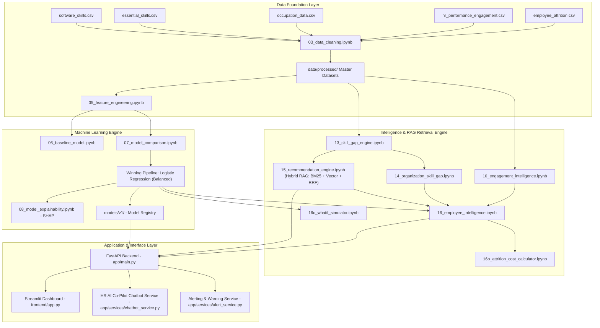

# 📖 Enterprise HR AI — Workforce Intelligence & Upskilling Platform

Enterprise HR AI is an agentic workforce intelligence platform that predicts employee attrition risk, analyzes engagement metrics, identifies individual and organizational skill gaps, recommends targeted upskilling paths via Hybrid RAG, calculates financial turnover cost exposures, provides interactive "what-if" policy simulations, and features an integrated **HR AI Co-Pilot Chatbot**.

---

## 🌐 Live Production Deployment Links

- 🎈 **Live Streamlit Dashboard**: [https://enterprisehrai-6yrgwiess7dtkromxfbrau.streamlit.app](https://enterprisehrai-6yrgwiess7dtkromxfbrau.streamlit.app)
- ⚙️ **Live Render FastAPI Backend**: [https://enterprise-hr-ai-backend.onrender.com](https://enterprise-hr-ai-backend.onrender.com)
- 📄 **Interactive Swagger API Documentation**: [https://enterprise-hr-ai-backend.onrender.com/docs](https://enterprise-hr-ai-backend.onrender.com/docs)

---

## 🏗️ System Architecture Overview



---

## 📊 Machine Learning Performance Benchmark

| Model Name | Precision | Recall | F1-Score | ROC-AUC | Missed Flight Risks (FN) | Status |
|---|---|---|---|---|---|---|
| **Logistic Regression (Balanced)** 🏆 | **0.4286** | **0.7660** | **0.5496** | **0.8258** | **11** | **SELECTED WINNER** |
| **XGBoost** | 0.5484 | 0.3617 | 0.4359 | 0.7725 | 30 | Evaluated |
| **Random Forest** | 0.7500 | 0.1915 | 0.3051 | 0.7818 | 38 | Evaluated |

> **Key Modeling Metric**: **Recall = 76.6%** ensuring the platform captures over three-quarters of all actual flight-risk employees before resignation.

---

## 🎯 Hybrid RAG Retrieval Engine Benchmark

Our upskilling recommendation engine combines **BM25 Lexical Keyword Search** + **Dense TF-IDF Vector Similarity** fused via **Reciprocal Rank Fusion (RRF)**:

$$\text{RRF Score}(d) = \frac{1}{60 + r_{\text{dense}}(d)} + \frac{1}{60 + r_{\text{lexical}}(d)}$$

| RAG Evaluation Metric | Benchmark Value | Description |
|---|---|---|
| **Recall@3** | **`1.0000`** (**100%**) | **100% of all relevant upskilling courses** retrieved within top-3 recommendations |
| **Precision@3** | **`0.5000`** (**50%**) | 50% of top-3 retrieved courses are exact ground-truth matches |
| **Mean Reciprocal Rank (MRR)** | **`1.0000`** (**1.0**) | First relevant upskilling course returned at **Rank #1** position in 100% of queries |

---

## ✨ Key Platform Features

1. **Predictive Attrition Risk**: Predicts flight risk probabilities and categorizes workforce into **HIGH**, **MEDIUM**, and **LOW** risk tiers.
2. **SHAP Model Explainability**: Identifies global drivers (OverTime, MonthlyIncome, Promotion Delay) and individual employee risk factors.
3. **Skill Gap Deficit Engine**: Pinpoints individual and organizational missing essential/software skills across 338 high-severity gaps.
4. **Hybrid RAG Course Recommendation Engine**: Matches missing skills to upskilling courses using BM25, TF-IDF vectors, and RRF.
5. **Financial Cost Exposure Calculator**: Quantifies monetary replacement risk using standard HR turnover multipliers ($18.45M baseline organizational exposure).
6. **Interactive What-If Policy Simulator**: Simulates how salary hikes, overtime elimination, or work-life balance improvements reduce flight risk.
7. **💬 HR AI Co-Pilot Chatbot**: Natural language query interface processing employee flight risk, financial exposure, skill gap, and policy simulation questions.
8. **Automated Alerting**: Logs warning alerts to `data/alerts/alerts.jsonl` and sends optional Slack notifications when high-risk predictions occur.

---

## 🚀 Quickstart & Local Setup

### 1. Repository Setup & Environment
```powershell
git clone https://github.com/gargkomalll/enterprise-hr-ai.git
cd enterprise-hr-ai
python -m venv .venv
.venv\Scripts\activate
pip install -r requirements.txt
```

### 2. Launch FastAPI Backend
```powershell
uvicorn app.main:app --reload --port 8000
```
- **Interactive Swagger API Docs**: `http://127.0.0.1:8000/docs`

### 3. Launch Streamlit Dashboard
```powershell
streamlit run frontend/app.py
```
- **Dashboard Interface**: `http://localhost:8501`

### 4. Run Automated Testing Suite
```powershell
# Run full Pytest suite (10/10 tests pass)
python -m pytest tests/ -v

# Run RAG Evaluation Benchmark Script
python -m app.monitoring.rag_eval
```

---

## 🌐 Production Cloud Deployment Guide

### 1. ⚙️ Deploy FastAPI Backend on Render (Render.com)

1. Log in to [dashboard.render.com](https://dashboard.render.com/) with GitHub.
2. Click **New +** $\rightarrow$ select **Web Service**.
3. Connect repository **`gargkomalll/enterprise-hr-ai`**.
4. Configure Web Service:
   - **Name**: `enterprise-hr-ai-backend`
   - **Environment**: `Python`
   - **Build Command**: `pip install -r requirements.txt`
   - **Start Command**: `uvicorn app.main:app --host 0.0.0.0 --port $PORT`
5. Click **Create Web Service**. Render will build and deploy your API at `https://enterprise-hr-ai-backend.onrender.com`.

---

### 2. 🎈 Deploy Streamlit Dashboard on Streamlit Community Cloud

1. Log in to [share.streamlit.io](https://share.streamlit.io/) with GitHub.
2. Click **Create app** $\rightarrow$ select **Use existing repo**.
3. Configure App:
   - **Repository**: `gargkomalll/enterprise-hr-ai`
   - **Branch**: `main`
   - **Main file path**: `frontend/app.py`
4. Expand **Advanced Settings** $\rightarrow$ Add Environment Variable:
   - `BACKEND_URL`: `https://enterprise-hr-ai-backend.onrender.com`
5. Click **Deploy!** Streamlit Cloud will launch your live workforce intelligence dashboard!

---

## 🔌 API Endpoints List

| Method | Endpoint | Description |
|---|---|---|
| `GET` | `/` | API status and health check |
| `POST` | `/predict/attrition` | Predict attrition probability & risk tier for single employee payload |
| `GET` | `/dashboard/summary` | Executive KPI metrics (Total count, High-risk count, Avg engagement) |
| `GET` | `/dashboard/attrition-by-department` | Department-level attrition breakdown |
| `GET` | `/dashboard/skill-gaps` | Top organization-wide skill gap deficits |
| `GET` | `/dashboard/recommendations` | Upskilling course recommendation distribution |
| `GET` | `/employees/{employee_id}` | Single employee full intelligence profile |
| `POST` | `/simulate/whatif` | Simulate policy changes on employee flight risk |
| `GET` | `/dashboard/cost-exposure` | Financial turnover cost exposure breakdown |
| `POST` | `/chat` | HR AI Co-Pilot natural language intelligence assistant |

---

## 📉 Statistical Model & Data Drift Monitoring

- **Drift Execution**: Executed via `python -m app.monitoring.drift` comparing incoming predictions against baseline dataset.
- **Statistical Tests**: Uses Kolmogorov-Smirnov (KS) tests ($p < 0.05$ threshold) and Population Stability Index (PSI) to detect feature distribution shifts over time.
