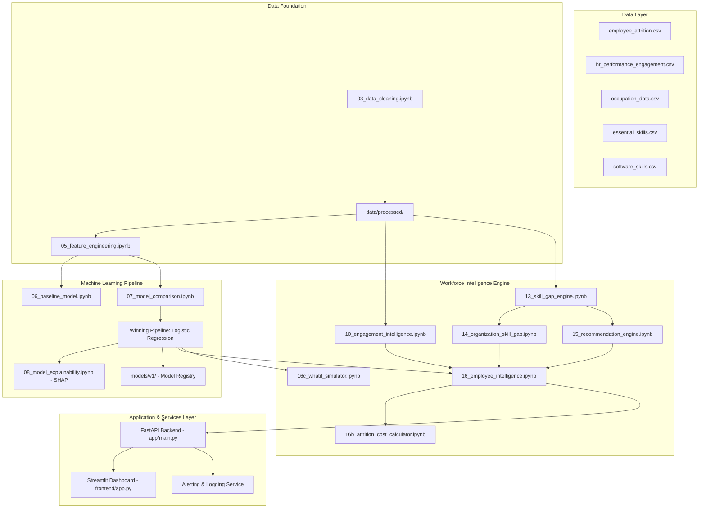

# Enterprise HR AI: Workforce Intelligence & Upskilling Platform

Enterprise HR AI is an agentic HR platform that predicts employee attrition risk, analyzes engagement metrics, identifies individual and organizational skill gaps, recommends targeted upskilling paths, calculates financial attrition cost exposure, and provides interactive "what-if" policy simulation.

---

## Architecture Overview



---

## Machine Learning Performance Benchmark

| Model Name | Precision | Recall | F1-Score | ROC-AUC | Missed Flight Risks (FN) | Status |
|---|---|---|---|---|---|---|
| **Logistic Regression (Balanced)** 🏆 | **0.4286** | **0.7660** | **0.5496** | **0.8258** | **11** | **SELECTED WINNER** |
| **XGBoost** | 0.5484 | 0.3617 | 0.4359 | 0.7725 | 30 | Evaluated |
| **Random Forest** | 0.7500 | 0.1915 | 0.3051 | 0.7818 | 38 | Evaluated |

---

## Key Features

1. **Predictive Attrition Risk**: Evaluates flight risk probability and assigns risk tiers (**HIGH**, **MEDIUM**, **LOW**).
2. **SHAP Model Explainability**: Company-wide global drivers (OverTime, Satisfaction, Income Progression) and local employee-level factors.
3. **Skill Gap Engine & Upskilling Recommendations**: Identifies missing essential and software skills, recommending courses via TF-IDF semantic embedding matching.
4. **Financial Cost Exposure Calculator**: Calculates monetary replacement costs using standard HR turnover multipliers (1.5x annual salary).
5. **Interactive What-If Policy Simulator**: Lets HR managers perturb compensation, overtime, and work-life balance to simulate flight risk reduction.
6. **Automated Alerting Service**: Triggers warning logs and optional Slack notifications when predictions flag high-risk employees.

---

## Quickstart & Local Setup

### 1. Installation
```powershell
git clone https://github.com/gargkomalll/enterprise-hr-ai.git
cd enterprise-hr-ai
python -m venv .venv
.venv\Scripts\activate
pip install -r requirements.txt
```

### 2. Run FastAPI Backend
```powershell
uvicorn app.main:app --reload --port 8000
```
- Interactive API Docs: `http://127.0.0.1:8000/docs`

### 3. Run Streamlit Dashboard
```powershell
streamlit run frontend/app.py
```
- Dashboard UI: `http://localhost:8501`

### 4. Run Pytest Verification Suite
```powershell
python -m pytest tests/ -v
```

---

## Docker Deployment

```powershell
docker-compose up --build
```
- Backend API: `http://localhost:8000`
- Frontend Dashboard: `http://localhost:8501`

---

## API Endpoints List

| Method | Endpoint | Description |
|---|---|---|
| `POST` | `/predict/attrition` | Predict attrition probability & risk tier for single employee payload |
| `GET` | `/dashboard/summary` | Overall KPI summary (Total count, High-risk count, Avg engagement) |
| `GET` | `/dashboard/attrition-by-department` | Department-level attrition breakdown |
| `GET` | `/dashboard/skill-gaps` | Top organization-wide skill gap deficits |
| `GET` | `/dashboard/recommendations` | Course recommendation distribution |
| `GET` | `/employees/{employee_id}` | Single employee full intelligence profile |
| `POST` | `/simulate/whatif` | Simulate policy changes on employee flight risk |
| `GET` | `/dashboard/cost-exposure` | Financial turnover cost exposure report |

---

## Retraining & Monitoring Strategy
- **Drift Checks**: Executed via `python -m app.monitoring.drift` comparing production predictions against baseline.
- **Triggers**: Automated retraining triggers if high-risk ratio shifts $> 10\%$ or 6 months of new outcome data arrives.
